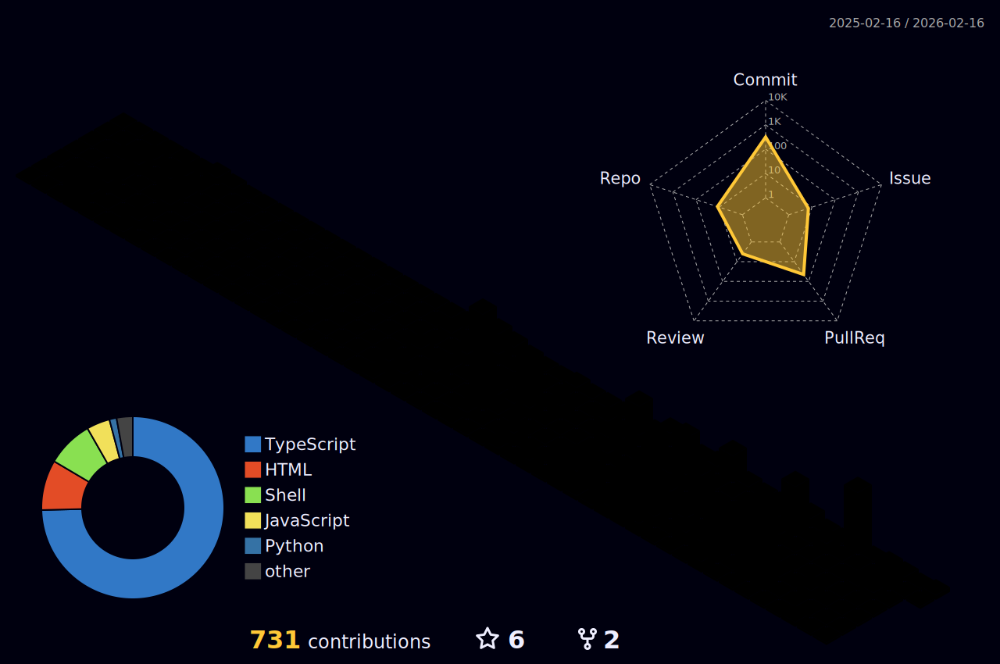

<pre>
███╗   ██╗ █████╗ ███╗   ███╗ █████╗ ███╗   ██╗
████╗  ██║██╔══██╗████╗ ████║██╔══██╗████╗  ██║
██╔██╗ ██║███████║██╔████╔██║███████║██╔██╗ ██║
██║╚██╗██║██╔══██║██║╚██╔╝██║██╔══██║██║╚██╗██║
██║ ╚████║██║  ██║██║ ╚═╝ ██║██║  ██║██║ ╚████║
╚═╝  ╚═══╝╚═╝  ╚═╝╚═╝     ╚═╝╚═╝  ╚═╝╚═╝  ╚═══╝
</pre>

---

### 🚀 Tech Stack

---

### 📊 GitHub Stats

<!-- Github Widgetbox - Profile statistics widget -->

---

### 🏆 GitHub Trophies

---

### 📈 3D Contribution Graph

<!-- Github Profile 3d Contrib - 3D contribution calendar -->

---

### 📈 Activity Graph

---

### 💭 Random Dev Quote

